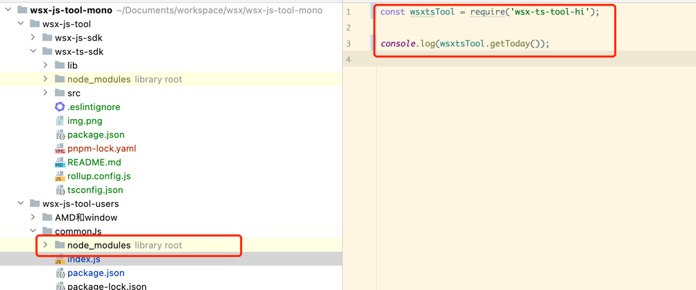
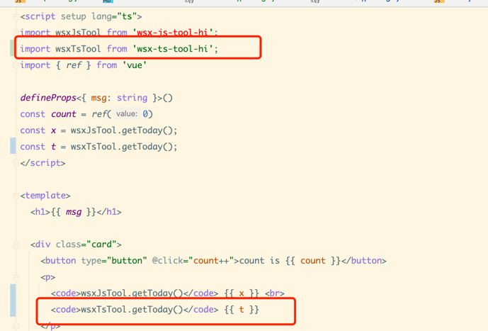
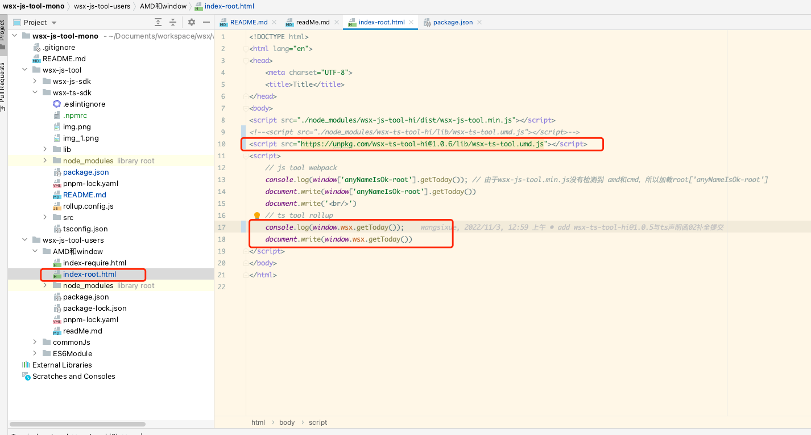

```json
"scripts": {
    "build": "rollup -c", // 打包出 cjs, esm, 和 umd 的包
    "build:types": "tsc"  // 打包出类型文件
},
```
tsc  typescript自带的编译工具 （通过tsc --init来生成tsconfig.json ）


###package.json
```
+ "main": "./lib/index.cjs.js", --- 入口文件
+ "module": "./lib/index.esm.js",  --- 
+ "types": "./lib/index.d.ts",
+ "files": [
+   "dist"
+ ],
"unpkg": "lib/wsx-ts-tool.umd.js",  ---- 开启npm的cdn模式 （在使用的html页面直接<script src="https://unpkg.com/wsx-ts-tool-hi@1.0.6/lib/wsx-ts-tool.umd.js"></script>  或者 <script src="https://unpkg.com/wsx-ts-tool-hi/lib/wsx-ts-tool.umd.js"></script>）
```
files 字段是用于约定在发包的时候NPM 会发布包含的文件和文件夹。

### rollup 打包
rollup -c  自动寻找      rollup.config.js配置文件

### amd的name定义，配置rollup.config.js，来增加打包后的umd.js的模块名称（amd和window下的）
name:  globle的name ，挂在window下

PS： 若使用iife或umd模块打包，需要添加属性moduleName，用来表示模块的名称；若用amd模块打包，可以配置amd相关的参数（使用umd模块模式时，也会使用到amd相关配置参数）：

amd: {
id: 'amd-name',   // amd具名函数名称
define: 'def'     // 用来代替define函数的函数名称
}
使用amd模块打包方式时，若不指定模块名称，则会打包成匿名函数，若想打包成一个具名函数，则需要使用-u或--id来指定具名函数名称。 TODO 如何配置

### ts声明文件生成
rollup-plugin-dts 在rollup中配置
```
 /* 单独生成声明文件 */
    {
        input: './src/main.ts',
        plugins: [dts()],
        output: {
            format: 'esm',
            file: 'lib/types/index.d.ts',
        },
    },
```
### .npmrc 设置npm config
registry=https://registry.npmjs.org/


### commonjs

### esm

### npm的ubpkg cdn
<script src="https://unpkg.com/wsx-ts-tool-hi@1.0.6/lib/wsx-ts-tool.umd.js"></script>

